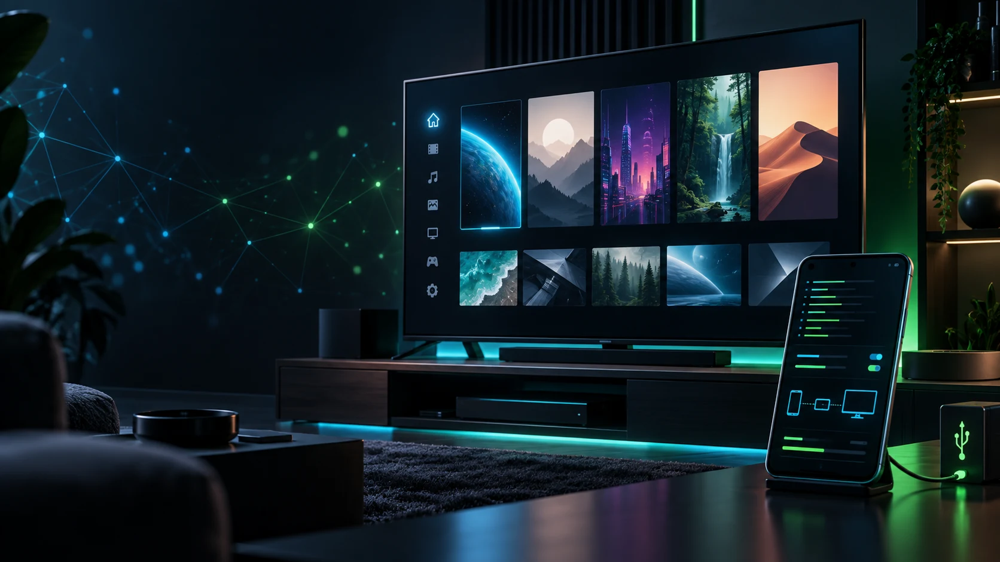

# MyownKodi

An Android-first development fork of [Kodi](https://kodi.tv/), focused on making a powerful media center easier to manage, back up, and control on modern Android devices.

> [!WARNING]
> MyownKodi is an independent community project. It is not an official Kodi or XBMC Foundation release, and it does not replace the official Kodi Android app.

<p align="center">
  <a href="LICENSE.md"></a>
  <a href="https://github.com/fearandlothing-productions/myownkodi/commits/main"></a>
  <a href="https://github.com/fearandlothing-productions/myownkodi/issues"></a>
</p>

## Why this fork exists

Android has made `Android/data` increasingly difficult to access with ordinary file managers. That complicates simple tasks such as retaining a profile before reinstalling an app, manually saving favourites, or inspecting `userdata` while troubleshooting.

MyownKodi explores Android-specific improvements while keeping Kodi's media-center experience at its core. The aim is practical ownership of the device and its media-center data, with every privileged integration opt-in and clearly documented.

## Android focus

### User data in Documents

This branch stores Kodi user data in the visible shared-storage directory:

```text
Documents/Kodi4Android/de.kodi4.android
```

This keeps files such as favourites, sources, settings, databases, and logs outside the app-private `Android/data` sandbox. The application package for this development fork is `de.kodi4.android`, so it can be installed separately from official Kodi.

Existing Android app-specific profiles are detected during first start and migrated into the new location. Keep a manual backup before changing builds, especially when testing development versions.

### Device control roadmap

MyownKodi is intended to grow into a more capable Android media-center environment. Planned work includes:

- ADB-aware device diagnostics and administration helpers.
- Optional command-line control for supported Android devices.
- Shizuku-assisted operations where Android's normal app permissions are insufficient.
- Better profile backup, restore, and migration tooling.
- Android TV-specific usability and troubleshooting improvements.

ADB and Shizuku support are roadmap items, not currently shipped features. Any future privileged action must require explicit user approval and should remain usable without elevated access whenever possible.

## Status

This is an experimental development fork. Expect incomplete features, changing behavior, and Android-specific testing requirements. Please do not treat it as a replacement for the official Kodi release on a production media library without maintaining your own backups.

| Area | Current state |
| --- | --- |
| Separate Android package | Available as `de.kodi4.android` |
| User data in shared Documents storage | Available in this branch |
| Legacy-profile migration | Available; verify backups before use |
| ADB command-line helpers | Planned |
| Shizuku integration | Planned |
| Android TV administration tools | Planned |

## Building for Android

The upstream Android build documentation remains the starting point:

- [Kodi Android build guide](docs/README.Android.md)
- [General build documentation](docs/README.md)

Because this fork has a different Android package name, release builds require their own signing and distribution process. Do not use the official Kodi signing identity or present a fork build as an official Kodi package.

## Relationship with Kodi upstream

MyownKodi follows the Kodi codebase and aims to keep general-purpose improvements suitable for upstream review. Android-specific experiments may remain in this fork until they are stable, tested, and appropriate for the main project.

Kodi is developed by the XBMC Foundation and its contributors. See the [official Kodi project](https://github.com/xbmc/xbmc), [Kodi website](https://kodi.tv/), and [Kodi documentation](https://kodi.wiki/) for official releases and support.

## Contributing

Bug reports, Android device-testing notes, and focused pull requests are welcome. When reporting an Android issue, include the Android version, device type, whether it is Android TV, the installation method, and relevant logs with personal paths or credentials removed.

For security-sensitive behavior, especially around ADB, Shizuku, storage access, or device permissions, please open a private security report rather than publishing credentials or personal data in an issue.

## License

MyownKodi remains licensed under the [GNU GPLv2](LICENSE.md), in accordance with the Kodi codebase. Kodi and related marks belong to their respective owners; this repository is not affiliated with or endorsed by the XBMC Foundation.
